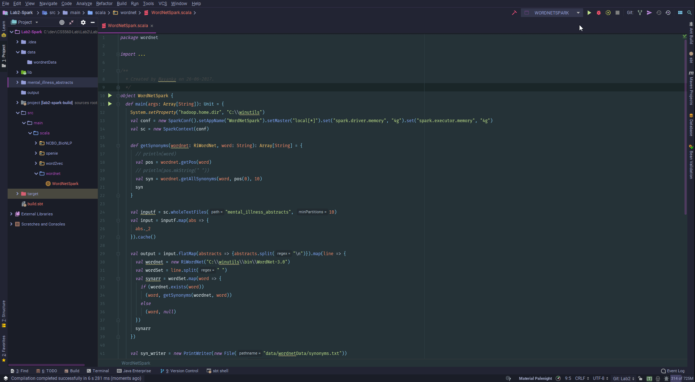
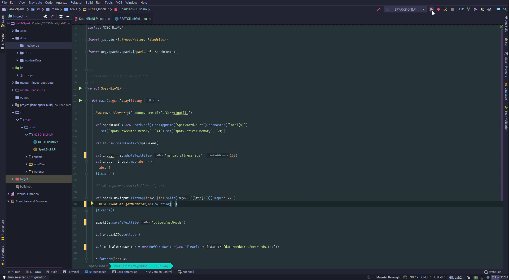

# KDM-Lab2

CS5560 Knowledge Discovery Management - Lab Assignment 2

# Introduction

For CS5560 Knowledge Discovery Management, Lab Assignment 2 will be working on 30 abstracts I have found to be used as data sets for my team's project that has been changed to Mental Illness. These abstracts are unique to the other team members' abstracts in order to retrieve and process as wide of range of data as possible. The abstracts, as opposed to Lab Assignment 1, were retrieved using a modified ICP under the search of `mental+illness+treatment` from NCBI's PubMed.

The project's goal is to construct a Knowledge Graph for Mental Illness. These 30 abstracts, for this assignment, will undergo Spark processing with basic Natural Language Processing (NLP) such as lemmatization. Then the abstracts will have Valid Word Filtering and Valid Medical Word Filtering performed on them. Additionally, the top 20 Term Frequency (TF) words will be found with their associated Word2Vec vectors.

## Tasks

For the 30 abstracts relevant to the project topic, Mental Illness perform the following:

1. Perform Basic NLP (Tokenization, Lemmatization) and provide the statistics
2. Perform Valid Word Filtering & Valid Medical Word Filtering and provide the statistics
3. Find the top 20 TF-IDF terms and provide the Word2Vec vectors
4. Fid the top TF-IDF of the medical words and provide the Word2Vec Vectors

## Setup

The following was provided by the instructor via zip files:

* WordNet-3.0 
* WinUtils.exe

[JetBrains IntelliJ](https://www.jetbrains.com/idea/) was used as the IDE to complete the assignment. This assignment required using the Java and Scala programming languages.

# Report Data Statistics

## WordNet Word Count

For the 30 abstracts, the total word count of each abstract was obtained and the total words recognized by WordNet was obtained. The synonyms of the words recognized by WordNet were also found.

## POS Count

For the 30 abstracts, the total count of nouns and verbs was obtained.

<figure>
    
    <figcaption>Part 1</figcaption>
</figure>

<figure>
    
    <figcaption>Part 2</figcaption>
</figure>

## Medical Words of Abstracts

For the 30 abstracts, the medical words within them were found using NCBI and PubTator. The REST call will return the title of the paper, the paper abstract, and then each word that was found within the following bioconcepts: Gene, Disease, Chemical, Species, Mutation. We're only interested in the medical related words, thus the title and the abstracts of the papers were ignored and the words with the PMID and the concept were saved into the `medWords.txt` file.

# Data Stats: Top TF-IDF and Word Vecs

## Top 20 TF-IDF

From the abstracts the Top 20 Term Frequency(TF) and Inverse Document Frequency(IDF) words were found. The top 20 TF-IDF for the abstracts as they are were found, the top 20 TF-IDF for the lemmatized words within the abstract were found, and the top 20 TF-IDF for the NGRAMS of the abstracts' words were found.

## Top 20 TF-IDF Word2Vec

From each of the Top 20 TF-IDF groups found in the previous step, each word in the top 20 was processed to find their respective vector.

# Source Code

The source code for this Lab Assignment was provided by the class instructor Mayanka ChandraShekar: [mckw9@mail.umkc.edu](mckw9@mail.umkc.edu) from previous ICPs