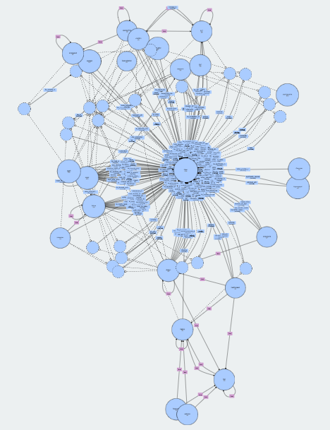
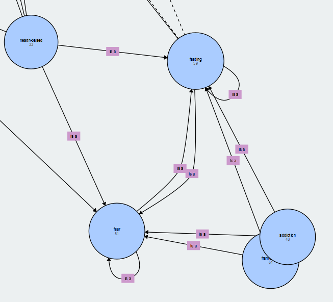
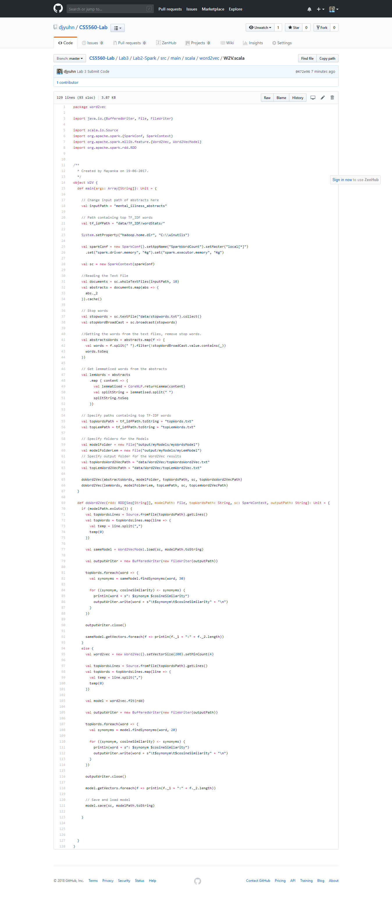
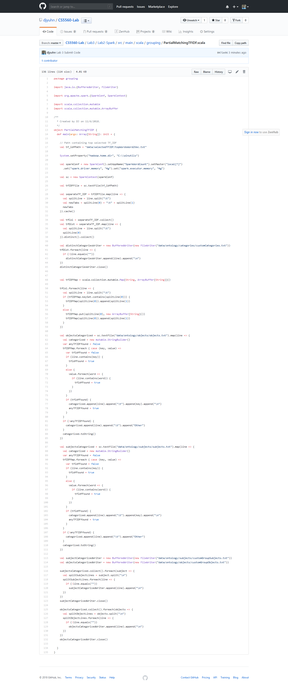
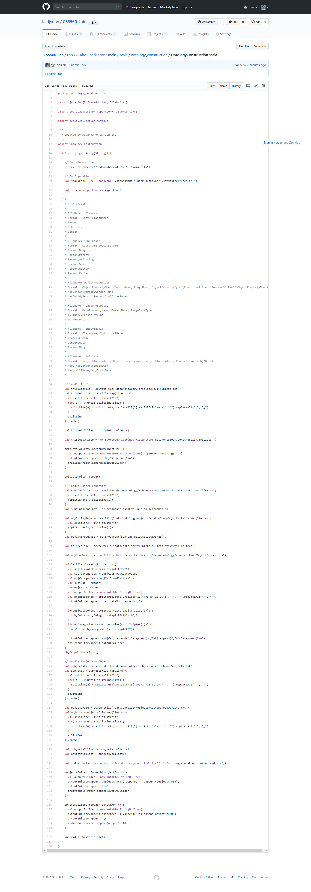

# KDM - Lab Assignment 3

## DJ Yuhn

CS5560 Knowledge Discovery Management - Lab Assignment 3

# Introduction

For CS5560 Knowledge Discovery Management, Lab Assignment 3 will be working on 100 abstracts I have found to be used as data sets for my team's project on Mental Illness. The abstracts were retrieved under the search of `mental+illness+treatment` from NCBI's PubMed.

The project's goal is to construct a Knowledge Graph for Mental Illness. These 100 abstracts, for this assignment, will undergo Spark processing with basic Natural Language Processing (NLP) such as lemmatization and stop words removed. The top 20 Term Frequency-Inverse Document Frequency (TF-IDF) words will be found with their associated Word2Vec vectors containing synonyms for each TF-IDF word.

These TF-IDF words will serve as the schema for the ontology construction. The triplets from the abstracts are extracted and separated into subjects, predicts, and objects. The subjects and objects will be classified under the TF-IDF words on the basis of partial matching. That is, if the TF-IDF word is contained within the subject or predict then it shall be classified under that category. If the TF-IDF word is not found, then the synonyms for the TF-IDF word are iterated through to see if the subject or object contains a partial match on one of its synonyms. If so, then the subject or object is classified under the TF-IDF word. If not, the subject or object is then classified under the default of "Other".

Once the subjects and objects have been classified, the ontology is constructed.

## Tasks

For the 100 abstracts relevant to the project topic, Mental Illness perform the following:

1. Perform Basic NLP (Tokenization, Lemmatization) and remove stop words
2. Report the entities (subjects and objects), predicates, and triplets
3. Find the top TF-IDF terms and provide their synonyms
4. Construct the ontology

## Setup

The following was provided by the instructor via zip files:

* WordNet-3.0 
* WinUtils.exe

[JetBrains IntelliJ](https://www.jetbrains.com/idea/) was used as the IDE to complete the assignment. This assignment required using the Java and Scala programming languages.

# Data and Data Stats

## Entities

| Subjects                                            | Objects                                              |
| --------------------------------------------------- | ---------------------------------------------------- |
| long-term health-related quality                    | treatment of choice for generalised anxiety disorder |
| treatment utilization                               | cognitive behavior like learning                     |
| resting-state functional magnetic resonance imaging | recent-onset schizophrenia                           |
| anxiety disorder                                    | lower incidence of relapse                           |
| eating-disorder psychopathology                     | mental/cognitive disability arise                    |

These are some of the entities found from the 100 abstracts after performing lemmatization and removing the stop words. To obtain more concise and accurate results, further filtering may need to be applied.

## Predicates

| Predicates            |
| --------------------- |
| will discuss          |
| further will describe |
| suffer from           |
| have increase over    |
| first examine         |

Several examples of predicates found after performing the lemmatization and removing stop words.

## Triplets

| Triplets             |              |                                                |
| -------------------- | ------------ | ---------------------------------------------- |
| dopaminergic agonist | be           | related                                        |
| dopaminergic agonist | be           | related                                        |
| female               | report       | higher rate of anemia                          |
| fasting              | influence    | fear memory formation                          |
| early intervention   | may decrease | financial burned associate with mental illness |

Examples of triplets found from the abstracts.

## TF-IDF Terms / Classes

| TF-IDF Terms                    | Synonyms                                                     |
| ------------------------------- | ------------------------------------------------------------ |
| fear                            | fasting, impairment, magnetic, addiction, somatic, schizophrenia, |
| lithium                         | ADHD, treatment, anxiety, mental, literature, disorders      |
| ECT (Electroconvulsive Therapy) | oxidative, mechanisms, assessment, childhood, research       |
| apomorphine                     | treatment, adiction, oxidative, biomarkers, negative         |
| psychotropics                   | disorder, treatment, limited, illness                        |

Several examples of some TF-IDF words used as classes for the ontology. Some of the TF-IDF words obtained are not particularly meaningful and were removed as class types for the ontology construction. However, this effects the classifying of the entities as the total number of possible classes has been decreased. This results in some entities having to be assigned a default class titled "Other".

In total, 47 classes were found from these TF-IDFs and 642 individuals were constructed.

## Data

More information related to the findings of this data can be located at https://www.box.com/home under my profile.

## Ontology

The image above displays the current ontology of the Mental Health Treatment aspect for the team's Mental Illness project. This ontology was constructed using the TF-IDF words and disregarded the medical words obtained from BioNLP for classification.

The image above illustrates a case of a class being assigned as a part of another class. That is, 'addiction' falls under both 'fear' and 'fasting' while also being its own class. This image also shows the case of the class 'fear' being in itself a class of 'fear'. That is, 'fear' is also an individual while also being a class.

# Source Code

The source code for this Lab Assignment was provided by the class instructor Mayanka ChandraShekar: [mckw9@mail.umkc.edu](mckw9@mail.umkc.edu) from previous ICPs

# Screenshots of Code

